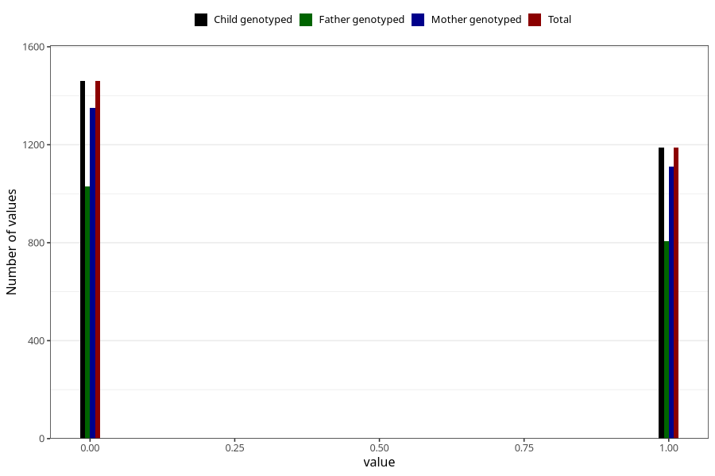

# frequent_stomach_pain_yes_3y
Variable mapping to `GG571` in `Skjema6_3aar_v12`.
- Number of values:

| Value | Total | Child genotyped | Mother genotyped | Father genotyped |
| ----- | ----- | --------------- | ---------------- | ---------------- |
| Missing | 78375 | 78375 | 73767 | 51475 |
| Non-missing | 2648 | 2648 | 2462 | 1836 |
| 0 | 1460 | 1460 | 1350 | 1029 |
| 1 | 1188 | 1188 | 1112 | 807 |

