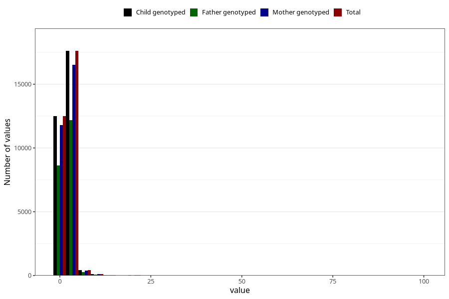

# gastric_flu_diarrhea_freq_3y
Variable mapping to `GG150` in `Skjema6_3aar_v12`.
- Number of values:

| Value | Total | Child genotyped | Mother genotyped | Father genotyped |
| ----- | ----- | --------------- | ---------------- | ---------------- |
| Missing | 50321 | 50321 | 47364 | 32093 |
| Non-missing | 30702 | 30702 | 28865 | 21218 |
| 25th percentile | 1 | 1 | 1 | 1 |
| 50th percentile | 2 | 2 | 2 | 2 |
| 75th percentile | 2 | 2 | 2 | 2 |
| Mean | 2.04970360237118 | 2.04970360237118 | 2.0424389398926 | 2.04529173343388 |
| Standard deviation | 1.95119895593677 | 1.95119895593677 | 1.94567478542962 | 1.74720232534641 |
| N | 30702 | 30702 | 28865 | 21218 |

