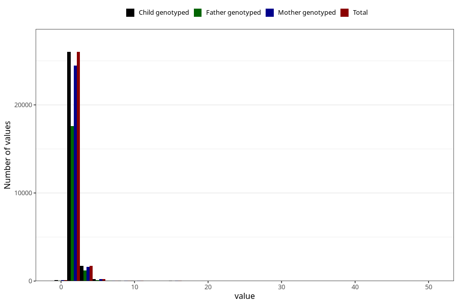

# gastric_flu_diarrhea_number_12_18m
Variable mapping to `EE243` in `Skjema5_18mnd_v12`.
- Number of values:

| Value | Total | Child genotyped | Mother genotyped | Father genotyped |
| ----- | ----- | --------------- | ---------------- | ---------------- |
| Missing | 52793 | 52793 | 49664 | 34229 |
| Non-missing | 28230 | 28230 | 26565 | 19082 |
| Filled in text or mark instead of number | 5 | 5 | 4 |3 |
| 25th percentile | 1 | 1 | 1 | 1 |
| 50th percentile | 1 | 1 | 1 | 1 |
| 75th percentile | 2 | 2 | 2 | 2 |
| Mean | 1.44531443755536 | 1.44531443755536 | 1.44403448665336 | 1.43602914198857 |
| Standard deviation | 1.2226868987404 | 1.2226868987404 | 1.1917300573257 | 1.14810731745842 |
| N | 28225 | 28225 | 26561 | 19079 |

