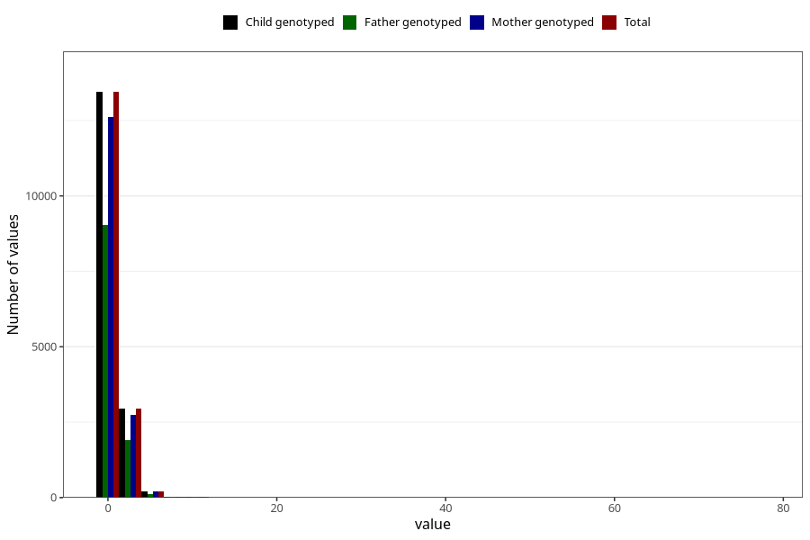

# gastric_flu_diarrhea_number_6_11m
Variable mapping to `EE241` in `Skjema5_18mnd_v12`.
- Number of values:

| Value | Total | Child genotyped | Mother genotyped | Father genotyped |
| ----- | ----- | --------------- | ---------------- | ---------------- |
| Missing | 64325 | 64325 | 60581 | 42175 |
| Non-missing | 16698 | 16698 | 15648 | 11136 |
| 25th percentile | 1 | 1 | 1 | 1 |
| 50th percentile | 1 | 1 | 1 | 1 |
| 75th percentile | 1 | 1 | 1 | 1 |
| Mean | 1.28769912564379 | 1.28769912564379 | 1.28393404907975 | 1.26697198275862 |
| Standard deviation | 1.20483676672391 | 1.20483676672391 | 1.19823587920376 | 1.17102008406905 |
| N | 16698 | 16698 | 15648 | 11136 |

