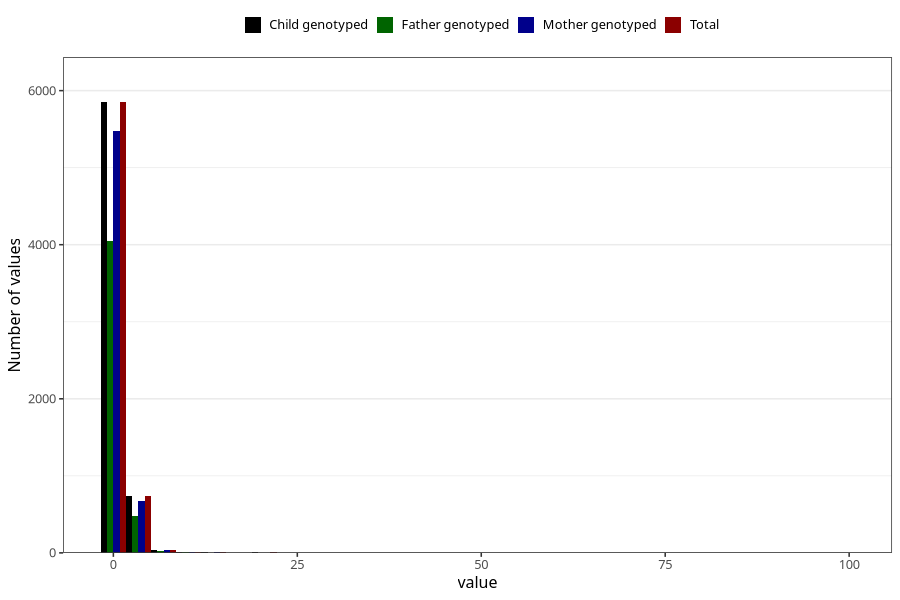

# gastric_flu_diarrhoea_freq_6m
Variable mapping to `DD284` in `Skjema4_6mnd_v12`.
- Number of values:

| Value | Total | Child genotyped | Mother genotyped | Father genotyped |
| ----- | ----- | --------------- | ---------------- | ---------------- |
| Missing | 74368 | 74368 | 70024 | 48743 |
| Non-missing | 6655 | 6655 | 6205 | 4568 |
| 25th percentile | 1 | 1 | 1 | 1 |
| 50th percentile | 1 | 1 | 1 | 1 |
| 75th percentile | 1 | 1 | 1 | 1 |
| Mean | 1.24477836213373 | 1.24477836213373 | 1.24077356970185 | 1.23489492119089 |
| Standard deviation | 1.7909306321066 | 1.7909306321066 | 1.82522462193382 | 1.97249300406807 |
| N | 6655 | 6655 | 6205 | 4568 |

