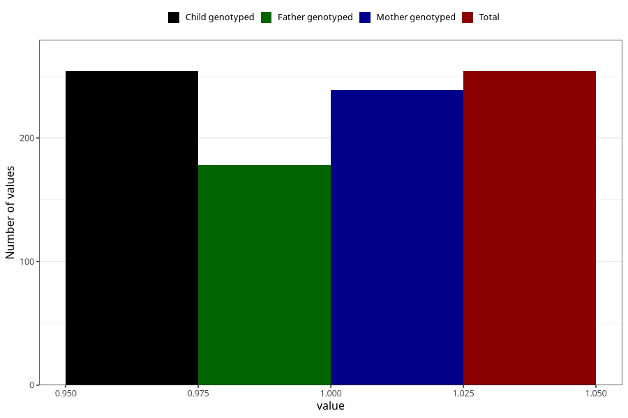

# heart_defect_yes_3y
Variable mapping to `GG62` in `Skjema6_3aar_v12`.
- Number of values:

| Value | Total | Child genotyped | Mother genotyped | Father genotyped |
| ----- | ----- | --------------- | ---------------- | ---------------- |
| Missing | 80769 | 80769 | 75990 | 53133 |
| Non-missing | 254 | 254 | 239 | 178 |
| 1 | 254 | 254 | 239 | 178 |

