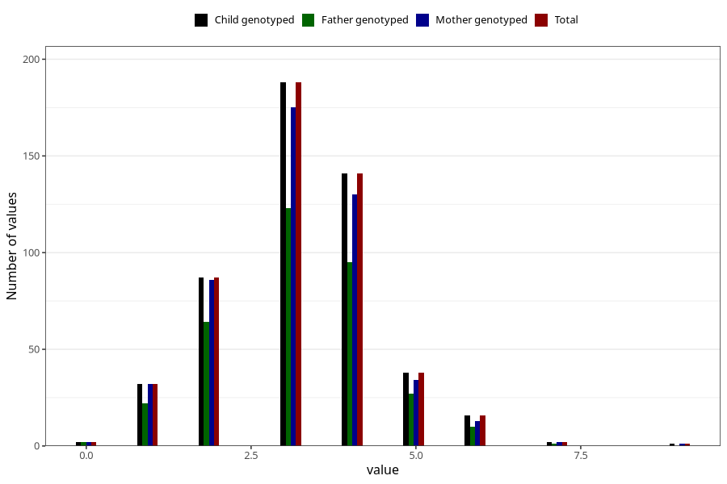

# hip_dysplasia_treatment_duration_6m
Variable mapping to `DD262` in `Skjema4_6mnd_v12`.
- Number of values:

| Value | Total | Child genotyped | Mother genotyped | Father genotyped |
| ----- | ----- | --------------- | ---------------- | ---------------- |
| Missing | 80516 | 80516 | 75754 | 52967 |
| Non-missing | 507 | 507 | 475 | 344 |
| 0 | 2 | 2 | 2 | 2 |
| 1 | 32 | 32 | 32 | 22 |
| 2 | 87 | 87 | 86 | 64 |
| 3 | 188 | 188 | 175 | 123 |
| 4 | 141 | 141 | 130 | 95 |
| 5 | 38 | 38 | 34 | 27 |
| 6 | 16 | 16 | 13 | 10 |
| 7 | 2 | 2 | 2 | 1 |
| 9 | 1 | 1 | 1 | 0 |

