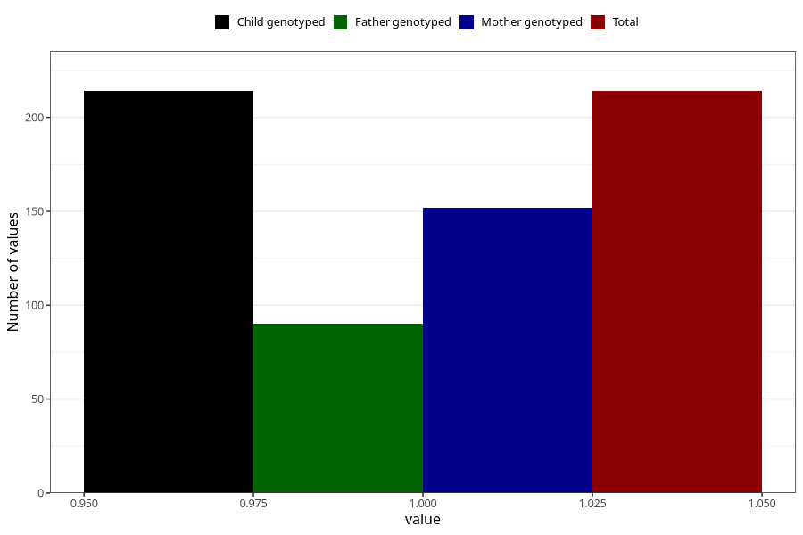

# hyperactivity_ADHD_7y
Variable mapping to `JJ431` in `Skjema7aar_v12`.
- Number of values:

| Value | Total | Child genotyped | Mother genotyped | Father genotyped |
| ----- | ----- | --------------- | ---------------- | ---------------- |
| Missing | 80809 | 80809 | 76077 | 53221 |
| Non-missing | 214 | 214 | 152 | 90 |
| 1 | 214 | 214 | 152 | 90 |

