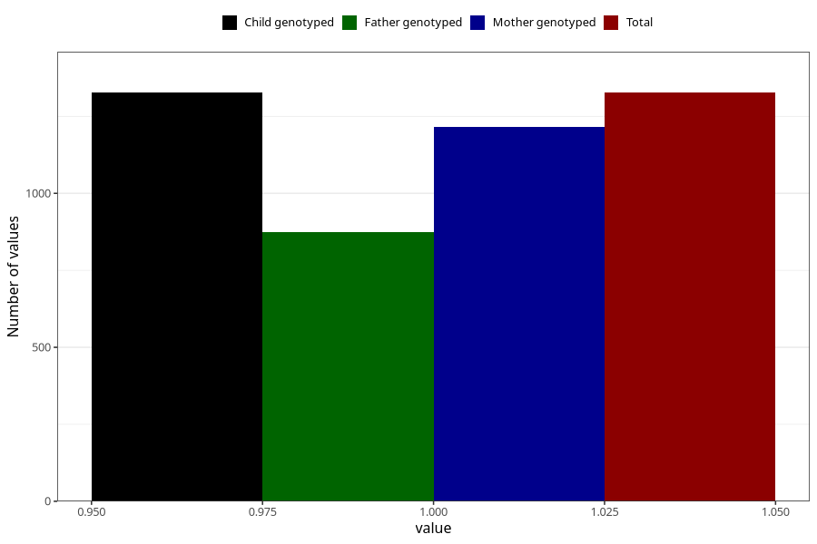

# impaired_hearing_previous_3y
Variable mapping to `GG31` in `Skjema6_3aar_v12`.
- Number of values:

| Value | Total | Child genotyped | Mother genotyped | Father genotyped |
| ----- | ----- | --------------- | ---------------- | ---------------- |
| Missing | 79696 | 79696 | 75013 | 52436 |
| Non-missing | 1327 | 1327 | 1216 | 875 |
| 1 | 1327 | 1327 | 1216 | 875 |

