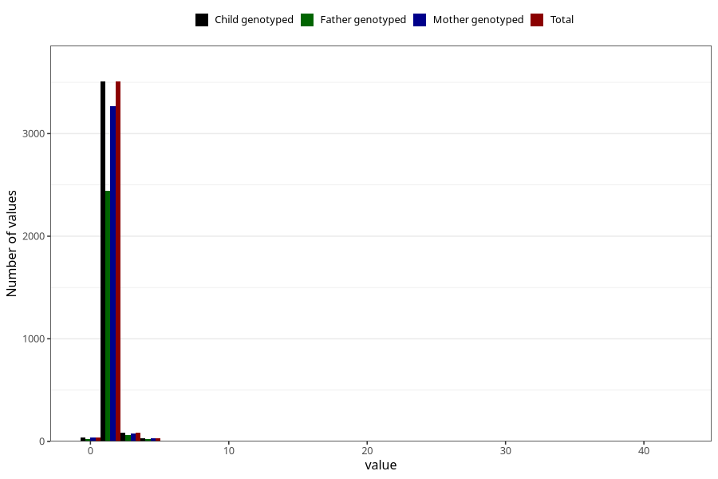

# injury_or_accident_freq_3y
Variable mapping to `GG165` in `Skjema6_3aar_v12`.
- Number of values:

| Value | Total | Child genotyped | Mother genotyped | Father genotyped |
| ----- | ----- | --------------- | ---------------- | ---------------- |
| Missing | 77356 | 77356 | 72811 | 50766 |
| Non-missing | 3667 | 3667 | 3418 | 2545 |
| 0 | 37 | 37 | 35 | 25 |
| 1 | 2974 | 2974 | 2772 | 2066 |
| 2 | 533 | 533 | 498 | 373 |
| 3 | 88 | 88 | 79 | 61 |
| 4 | 18 | 18 | 18 | 13 |
| 5 | 12 | 12 | 11 | 7 |
| 7 | 1 | 1 | 1 | 0 |
| 8 | 1 | 1 | 1 | 0 |
| 10 | 1 | 1 | 1 | 0 |
| 35 | 1 | 1 | 1 | 0 |
| 42 | 1 | 1 | 1 | 0 |

