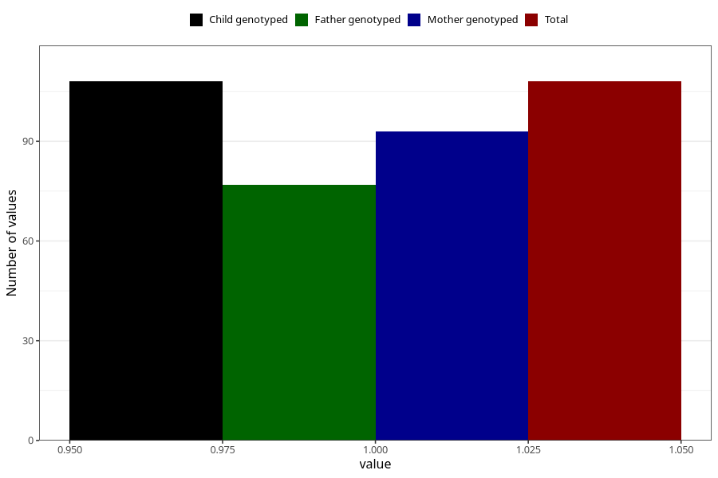

# joint_problems_previous_3y
Variable mapping to `GG47` in `Skjema6_3aar_v12`.
- Number of values:

| Value | Total | Child genotyped | Mother genotyped | Father genotyped |
| ----- | ----- | --------------- | ---------------- | ---------------- |
| Missing | 80915 | 80915 | 76136 | 53234 |
| Non-missing | 108 | 108 | 93 | 77 |
| 1 | 108 | 108 | 93 | 77 |

