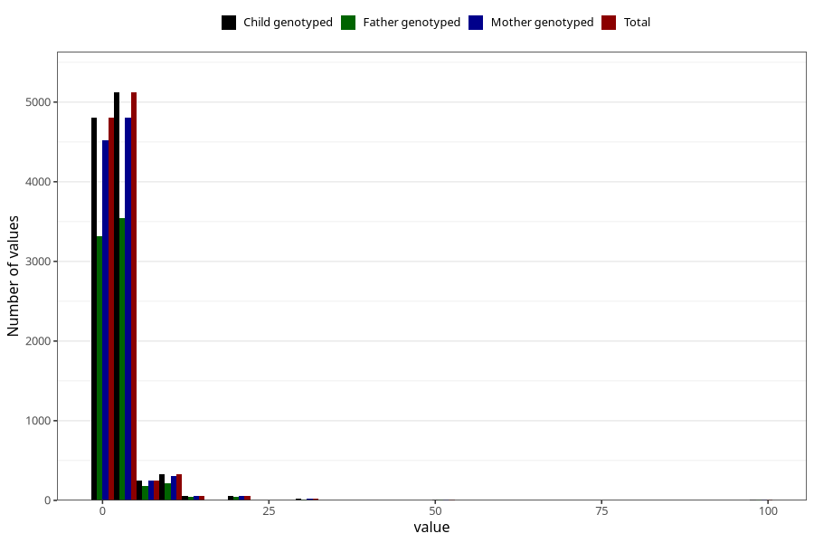

# nappy_rash_freq_6m
Variable mapping to `DD308` in `Skjema4_6mnd_v12`.
- Number of values:

| Value | Total | Child genotyped | Mother genotyped | Father genotyped |
| ----- | ----- | --------------- | ---------------- | ---------------- |
| Missing | 70350 | 70350 | 66189 | 45939 |
| Non-missing | 10673 | 10673 | 10040 | 7372 |
| 25th percentile | 1 | 1 | 1 | 1 |
| 50th percentile | 2 | 2 | 2 | 2 |
| 75th percentile | 3 | 3 | 3 | 3 |
| Mean | 2.6982104375527 | 2.6982104375527 | 2.70836653386454 | 2.66128594682583 |
| Standard deviation | 4.55271612567753 | 4.55271612567753 | 4.55776197968783 | 4.26384011433167 |
| N | 10673 | 10673 | 10040 | 7372 |

