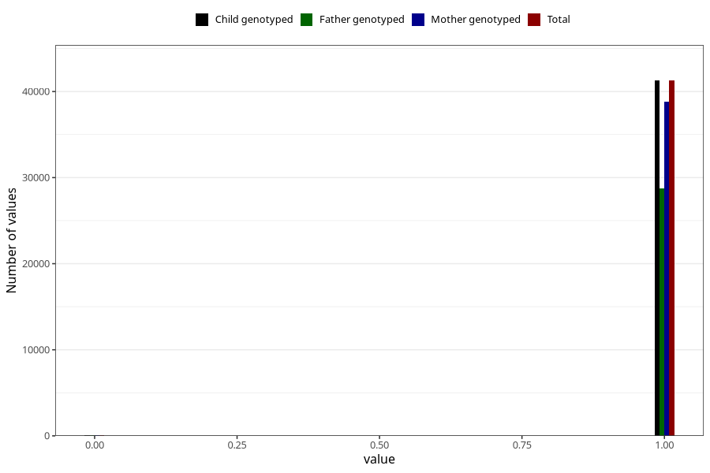

# other_gastrointestinal_problems_2_no_3y
Variable mapping to `GG574` in `Skjema6_3aar_v12`.
- Number of values:

| Value | Total | Child genotyped | Mother genotyped | Father genotyped |
| ----- | ----- | --------------- | ---------------- | ---------------- |
| Missing | 39674 | 39674 | 37341 | 24480 |
| Non-missing | 41349 | 41349 | 38888 | 28831 |
| 0 | 76 | 76 | 72 | 50 |
| 1 | 41273 | 41273 | 38816 | 28781 |

