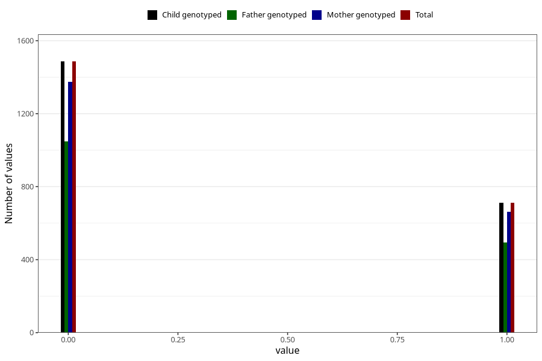

# other_gastrointestinal_problems_2_previous_3y
Variable mapping to `GG576` in `Skjema6_3aar_v12`.
- Number of values:

| Value | Total | Child genotyped | Mother genotyped | Father genotyped |
| ----- | ----- | --------------- | ---------------- | ---------------- |
| Missing | 78825 | 78825 | 74193 | 51770 |
| Non-missing | 2198 | 2198 | 2036 | 1541 |
| 0 | 1486 | 1486 | 1375 | 1047 |
| 1 | 712 | 712 | 661 | 494 |

