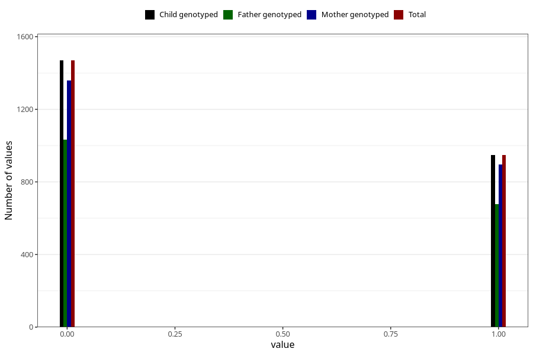

# other_gastrointestinal_problems_2_yes_3y
Variable mapping to `GG575` in `Skjema6_3aar_v12`.
- Number of values:

| Value | Total | Child genotyped | Mother genotyped | Father genotyped |
| ----- | ----- | --------------- | ---------------- | ---------------- |
| Missing | 78605 | 78605 | 73974 | 51600 |
| Non-missing | 2418 | 2418 | 2255 | 1711 |
| 0 | 1469 | 1469 | 1360 | 1032 |
| 1 | 949 | 949 | 895 | 679 |

