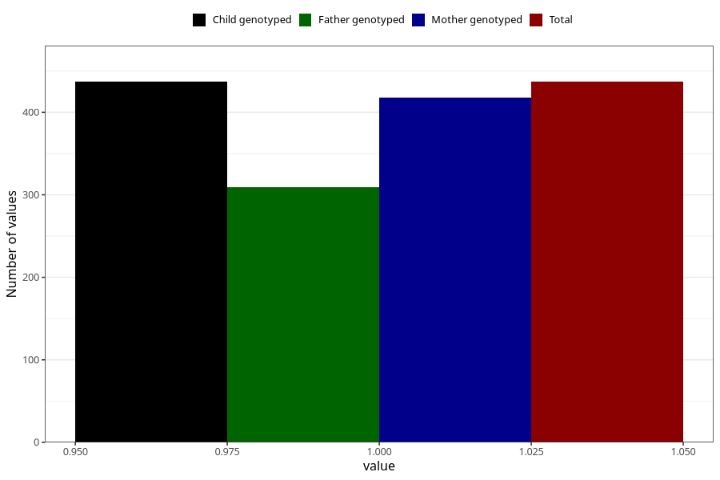

# other_malformations_previously_18m
Variable mapping to `EE853` in `Skjema5_18mnd_v12`.
- Number of values:

| Value | Total | Child genotyped | Mother genotyped | Father genotyped |
| ----- | ----- | --------------- | ---------------- | ---------------- |
| Missing | 80586 | 80586 | 75811 | 53002 |
| Non-missing | 437 | 437 | 418 | 309 |
| 1 | 437 | 437 | 418 | 309 |

