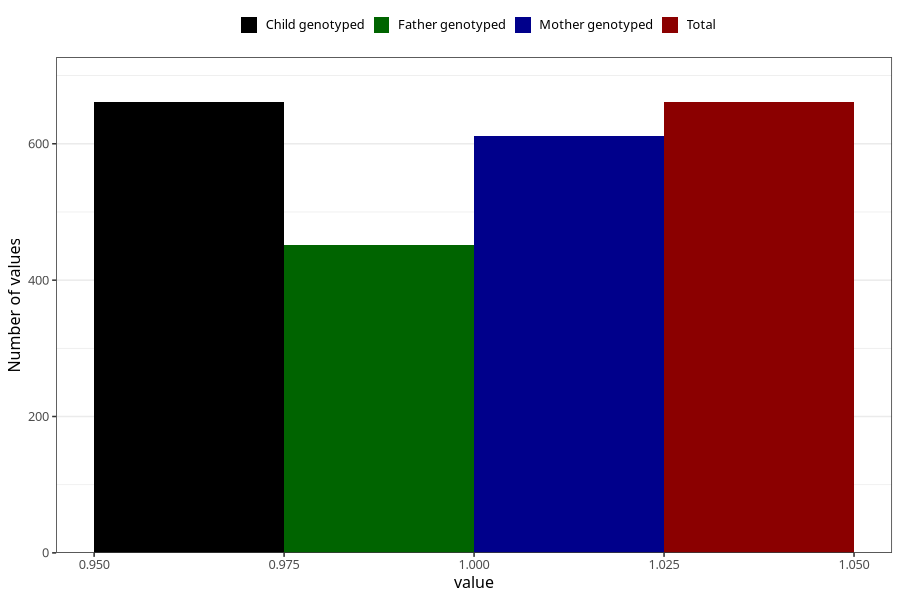

# other_malformations_yes_18m
Variable mapping to `EE852` in `Skjema5_18mnd_v12`.
- Number of values:

| Value | Total | Child genotyped | Mother genotyped | Father genotyped |
| ----- | ----- | --------------- | ---------------- | ---------------- |
| Missing | 80362 | 80362 | 75618 | 52860 |
| Non-missing | 661 | 661 | 611 | 451 |
| 1 | 661 | 661 | 611 | 451 |

