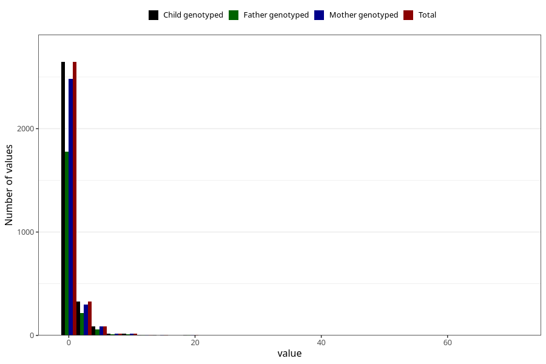

# other_number_12_18m
Variable mapping to `EE273` in `Skjema5_18mnd_v12`.
- Number of values:

| Value | Total | Child genotyped | Mother genotyped | Father genotyped |
| ----- | ----- | --------------- | ---------------- | ---------------- |
| Missing | 77905 | 77905 | 73304 | 51219 |
| Non-missing | 3118 | 3118 | 2925 | 2092 |
| Filled in text or mark instead of number | 4 | 4 | 4 |4 |
| 25th percentile | 1 | 1 | 1 | 1 |
| 50th percentile | 1 | 1 | 1 | 1 |
| 75th percentile | 1 | 1 | 1 | 1 |
| Mean | 1.41233140655106 | 1.41233140655106 | 1.41561109209175 | 1.39367816091954 |
| Standard deviation | 2.32920027898083 | 2.32920027898083 | 2.37159620068632 | 2.12976223635053 |
| N | 3114 | 3114 | 2921 | 2088 |

