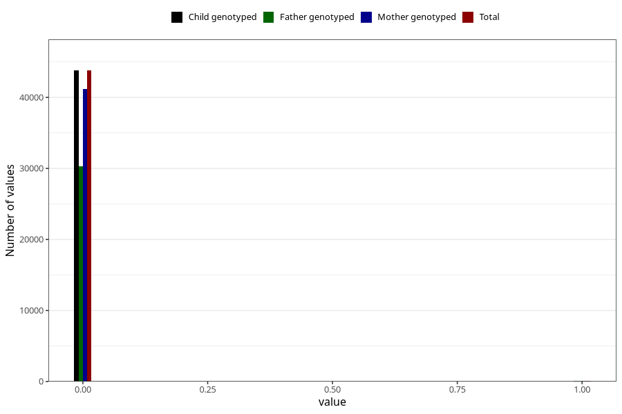

# overweight_3y
Variable created during phenotype curation.
- Number of values:

| Value | Total | Child genotyped | Mother genotyped | Father genotyped |
| ----- | ----- | --------------- | ---------------- | ---------------- |
| Missing | 37124 | 37124 | 34929 | 22969 |
| Non-missing | 43899 | 43899 | 41300 | 30342 |
| 0 | 43782 | 43782 | 41190 | 30257 |
| 1 | 117 | 117 | 110 | 85 |

