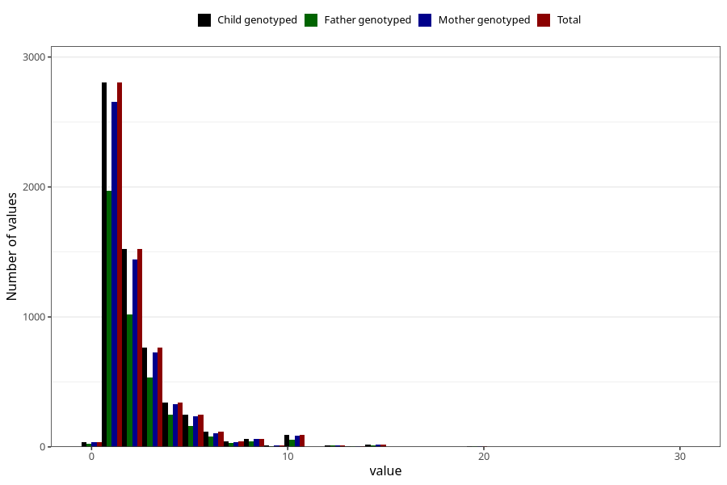

# pseudo_croup_freq_3y
Variable mapping to `GG141` in `Skjema6_3aar_v12`.
- Number of values:

| Value | Total | Child genotyped | Mother genotyped | Father genotyped |
| ----- | ----- | --------------- | ---------------- | ---------------- |
| Missing | 74940 | 74940 | 70463 | 49104 |
| Non-missing | 6083 | 6083 | 5766 | 4207 |
| 25th percentile | 1 | 1 | 1 | 1 |
| 50th percentile | 2 | 2 | 2 | 2 |
| 75th percentile | 3 | 3 | 3 | 3 |
| Mean | 2.29261877363143 | 2.29261877363143 | 2.27783558792924 | 2.28880437366294 |
| Standard deviation | 2.11075831275699 | 2.11075831275699 | 2.07094078399482 | 2.16465044009819 |
| N | 6083 | 6083 | 5766 | 4207 |

