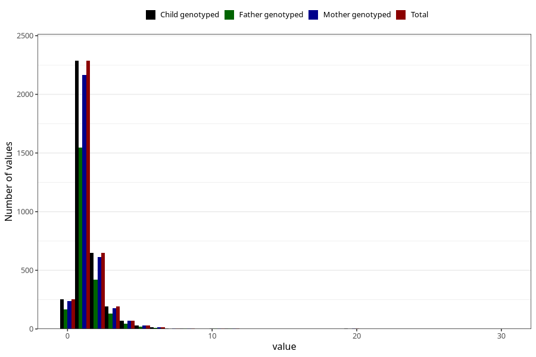

# pseudocroup_number_6_11m
Variable mapping to `EE231` in `Skjema5_18mnd_v12`.
- Number of values:

| Value | Total | Child genotyped | Mother genotyped | Father genotyped |
| ----- | ----- | --------------- | ---------------- | ---------------- |
| Missing | 77504 | 77504 | 72907 | 50955 |
| Non-missing | 3519 | 3519 | 3322 | 2356 |
| 0 | 253 | 253 | 237 | 168 |
| 1 | 2286 | 2286 | 2163 | 1548 |
| 2 | 648 | 648 | 612 | 420 |
| 3 | 191 | 191 | 178 | 129 |
| 4 | 72 | 72 | 68 | 47 |
| 5 | 31 | 31 | 30 | 21 |
| 6 | 17 | 17 | 15 | 10 |
| 7 | 3 | 3 | 3 | 1 |
| 8 | 5 | 5 | 4 | 4 |
| 9 | 1 | 1 | 1 | 1 |
| 10 | 6 | 6 | 5 | 4 |
| 11 | 3 | 3 | 3 | 2 |
| 20 | 2 | 2 | 2 | 1 |
| 30 | 1 | 1 | 1 | 0 |

