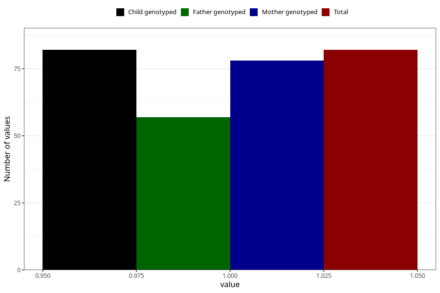

# rheumatoid_arthritis_8y
Variable mapping to `NN26` in `Skjema8aar_v12`.
- Number of values:

| Value | Total | Child genotyped | Mother genotyped | Father genotyped |
| ----- | ----- | --------------- | ---------------- | ---------------- |
| Missing | 80941 | 80941 | 76151 | 53254 |
| Non-missing | 82 | 82 | 78 | 57 |
| 1 | 82 | 82 | 78 | 57 |

