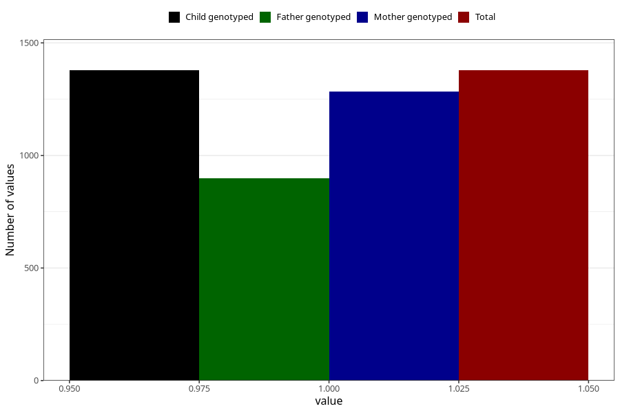

# sleep_problems_previous_3y
Variable mapping to `GG99` in `Skjema6_3aar_v12`.
- Number of values:

| Value | Total | Child genotyped | Mother genotyped | Father genotyped |
| ----- | ----- | --------------- | ---------------- | ---------------- |
| Missing | 79645 | 79645 | 74945 | 52413 |
| Non-missing | 1378 | 1378 | 1284 | 898 |
| 1 | 1378 | 1378 | 1284 | 898 |

