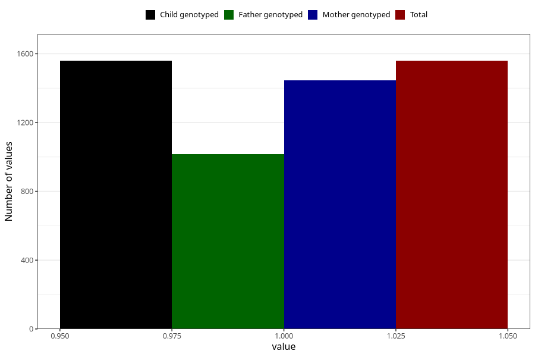

# sleep_problems_yes_18m
Variable mapping to `EE844` in `Skjema5_18mnd_v12`.
- Number of values:

| Value | Total | Child genotyped | Mother genotyped | Father genotyped |
| ----- | ----- | --------------- | ---------------- | ---------------- |
| Missing | 79464 | 79464 | 74783 | 52296 |
| Non-missing | 1559 | 1559 | 1446 | 1015 |
| 1 | 1559 | 1559 | 1446 | 1015 |

