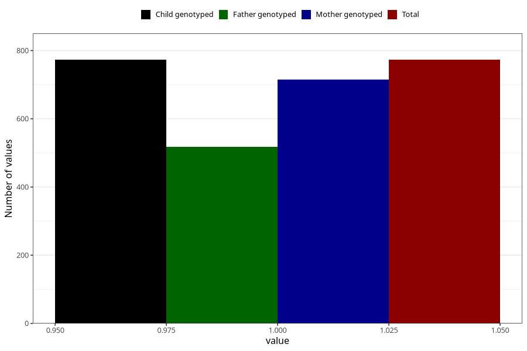

# sleep_problems_yes_3y
Variable mapping to `GG98` in `Skjema6_3aar_v12`.
- Number of values:

| Value | Total | Child genotyped | Mother genotyped | Father genotyped |
| ----- | ----- | --------------- | ---------------- | ---------------- |
| Missing | 80250 | 80250 | 75514 | 52794 |
| Non-missing | 773 | 773 | 715 | 517 |
| 1 | 773 | 773 | 715 | 517 |

