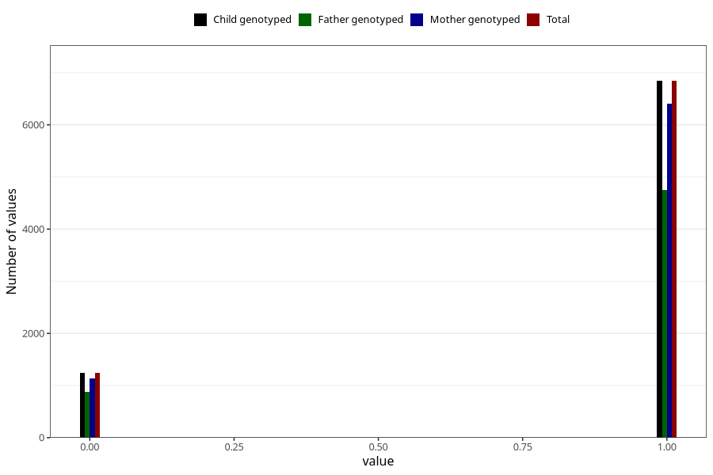

# specialist_diagnosis_1_3y
Variable mapping to `GG118` in `Skjema6_3aar_v12`.
- Number of values:

| Value | Total | Child genotyped | Mother genotyped | Father genotyped |
| ----- | ----- | --------------- | ---------------- | ---------------- |
| Missing | 72943 | 72943 | 68680 | 47680 |
| Non-missing | 8080 | 8080 | 7549 | 5631 |
| 0 | 1238 | 1238 | 1143 | 876 |
| 1 | 6842 | 6842 | 6406 | 4755 |

