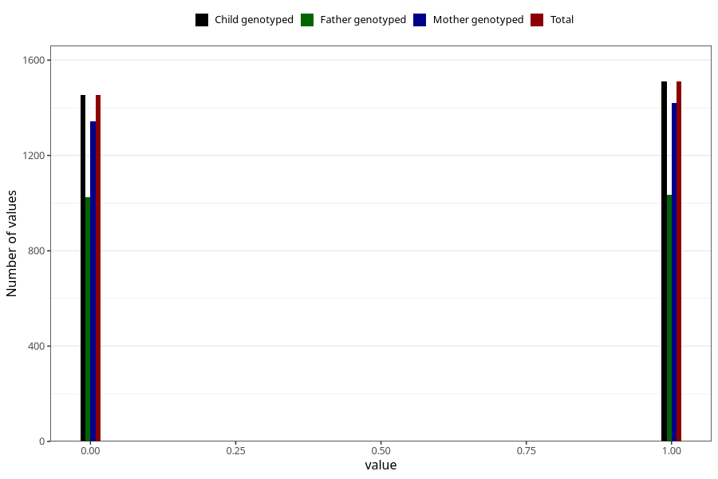

# specialist_diagnosis_2_3y
Variable mapping to `GG120` in `Skjema6_3aar_v12`.
- Number of values:

| Value | Total | Child genotyped | Mother genotyped | Father genotyped |
| ----- | ----- | --------------- | ---------------- | ---------------- |
| Missing | 78059 | 78059 | 73467 | 51250 |
| Non-missing | 2964 | 2964 | 2762 | 2061 |
| 0 | 1454 | 1454 | 1342 | 1026 |
| 1 | 1510 | 1510 | 1420 | 1035 |

