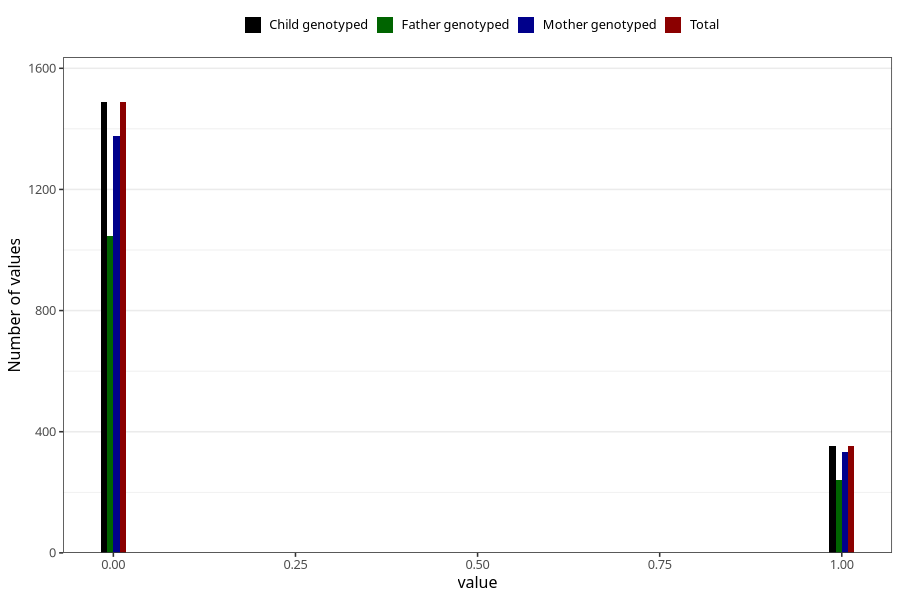

# specialist_diagnosis_3_3y
Variable mapping to `GG122` in `Skjema6_3aar_v12`.
- Number of values:

| Value | Total | Child genotyped | Mother genotyped | Father genotyped |
| ----- | ----- | --------------- | ---------------- | ---------------- |
| Missing | 79183 | 79183 | 74521 | 52024 |
| Non-missing | 1840 | 1840 | 1708 | 1287 |
| 0 | 1488 | 1488 | 1376 | 1046 |
| 1 | 352 | 352 | 332 | 241 |

