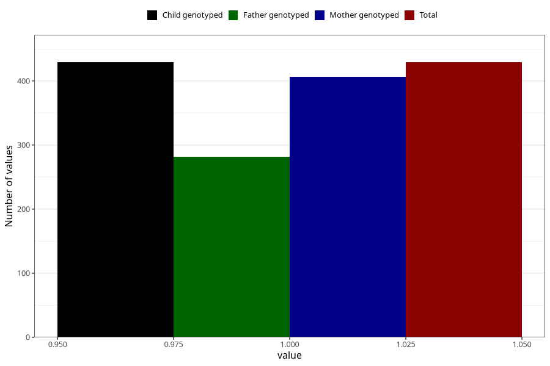

# testicles_not_descended_into_scrotum_yes_18m
Variable mapping to `EE820` in `Skjema5_18mnd_v12`.
- Number of values:

| Value | Total | Child genotyped | Mother genotyped | Father genotyped |
| ----- | ----- | --------------- | ---------------- | ---------------- |
| Missing | 80594 | 80594 | 75823 | 53029 |
| Non-missing | 429 | 429 | 406 | 282 |
| 1 | 429 | 429 | 406 | 282 |

