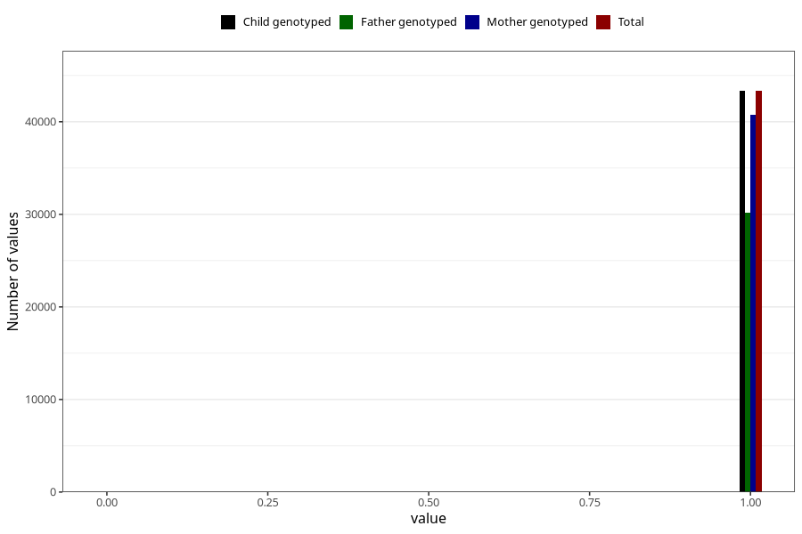

# trouble_relating_to_others_no_3y
Variable mapping to `GG578` in `Skjema6_3aar_v12`.
- Number of values:

| Value | Total | Child genotyped | Mother genotyped | Father genotyped |
| ----- | ----- | --------------- | ---------------- | ---------------- |
| Missing | 37677 | 37677 | 35469 | 23085 |
| Non-missing | 43346 | 43346 | 40760 | 30226 |
| 0 | 20 | 20 | 19 | 14 |
| 1 | 43326 | 43326 | 40741 | 30212 |

