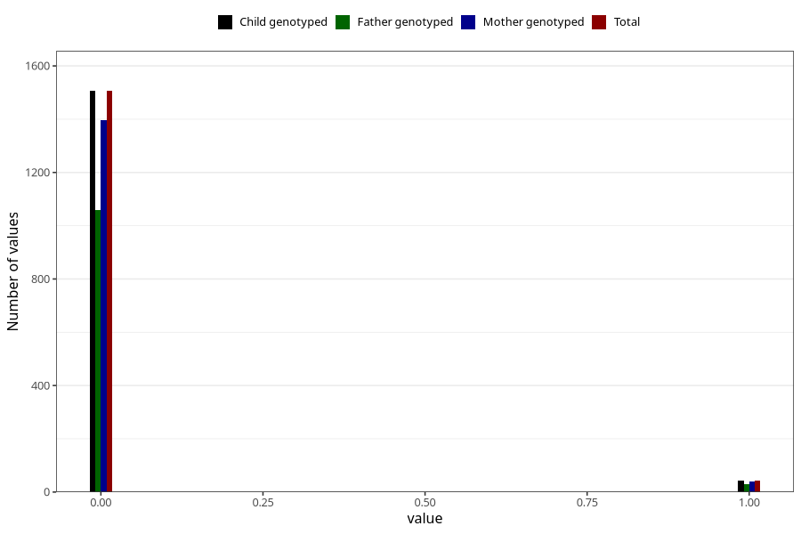

# trouble_relating_to_others_previous_3y
Variable mapping to `GG580` in `Skjema6_3aar_v12`.
- Number of values:

| Value | Total | Child genotyped | Mother genotyped | Father genotyped |
| ----- | ----- | --------------- | ---------------- | ---------------- |
| Missing | 79473 | 79473 | 74795 | 52224 |
| Non-missing | 1550 | 1550 | 1434 | 1087 |
| 0 | 1506 | 1506 | 1395 | 1058 |
| 1 | 44 | 44 | 39 | 29 |

