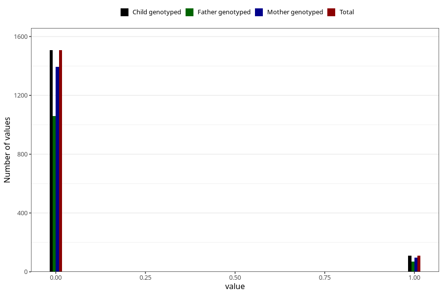

# trouble_relating_to_others_yes_3y
Variable mapping to `GG579` in `Skjema6_3aar_v12`.
- Number of values:

| Value | Total | Child genotyped | Mother genotyped | Father genotyped |
| ----- | ----- | --------------- | ---------------- | ---------------- |
| Missing | 79406 | 79406 | 74736 | 52184 |
| Non-missing | 1617 | 1617 | 1493 | 1127 |
| 0 | 1507 | 1507 | 1395 | 1058 |
| 1 | 110 | 110 | 98 | 69 |

