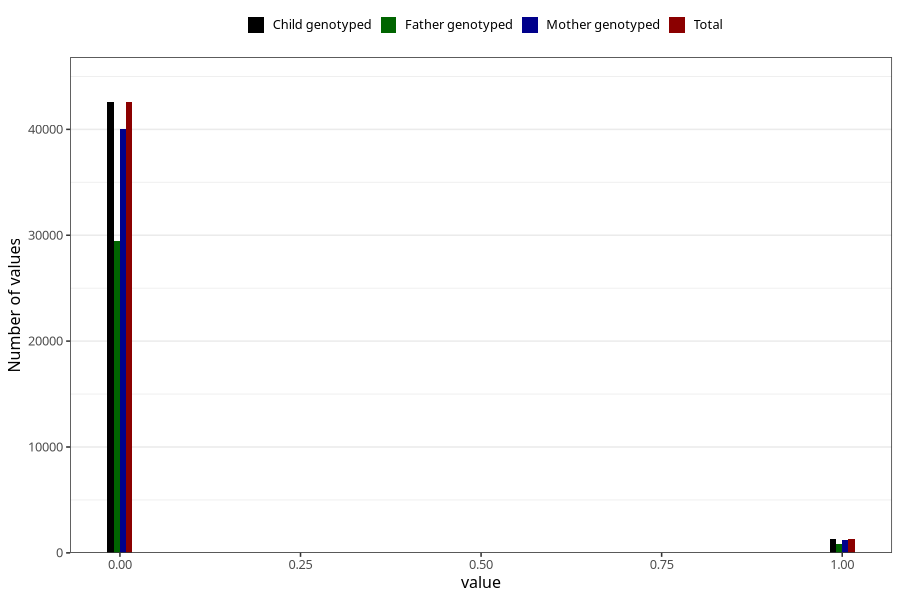

# underweight_3y
Variable created during phenotype curation.
- Number of values:

| Value | Total | Child genotyped | Mother genotyped | Father genotyped |
| ----- | ----- | --------------- | ---------------- | ---------------- |
| Missing | 37153 | 37153 | 34956 | 23001 |
| Non-missing | 43870 | 43870 | 41273 | 30310 |
| 0 | 42564 | 42564 | 40064 | 29439 |
| 1 | 1306 | 1306 | 1209 | 871 |

