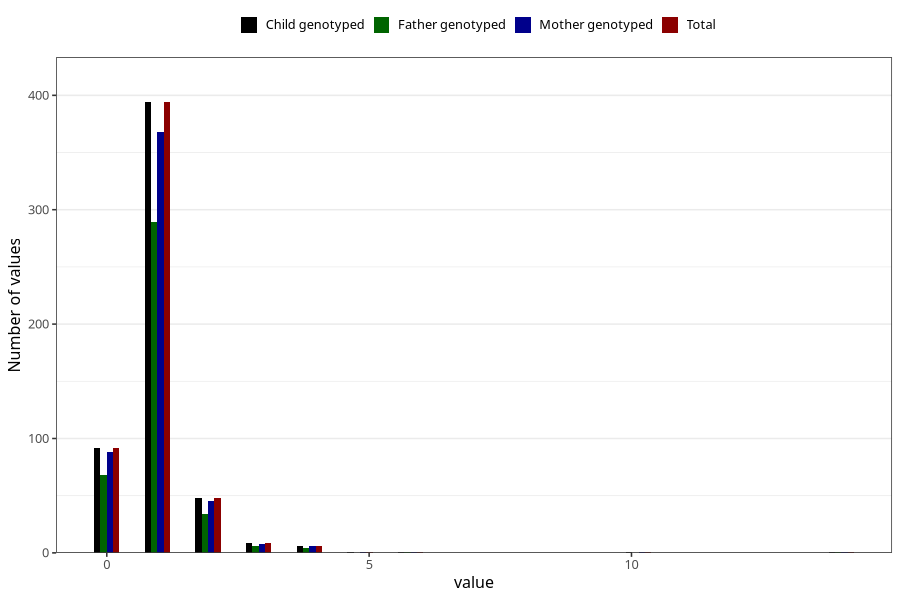

# urinary_tract_infection_freq_6m
Variable mapping to `DD288` in `Skjema4_6mnd_v12`.
- Number of values:

| Value | Total | Child genotyped | Mother genotyped | Father genotyped |
| ----- | ----- | --------------- | ---------------- | ---------------- |
| Missing | 80470 | 80470 | 75710 | 52908 |
| Non-missing | 553 | 553 | 519 | 403 |
| 0 | 92 | 92 | 88 | 68 |
| 1 | 394 | 394 | 368 | 289 |
| 2 | 48 | 48 | 45 | 34 |
| 3 | 9 | 9 | 8 | 6 |
| 4 | 6 | 6 | 6 | 4 |
| 5 | 1 | 1 | 1 | 0 |
| 6 | 1 | 1 | 1 | 1 |
| 10 | 1 | 1 | 1 | 0 |
| 14 | 1 | 1 | 1 | 1 |

