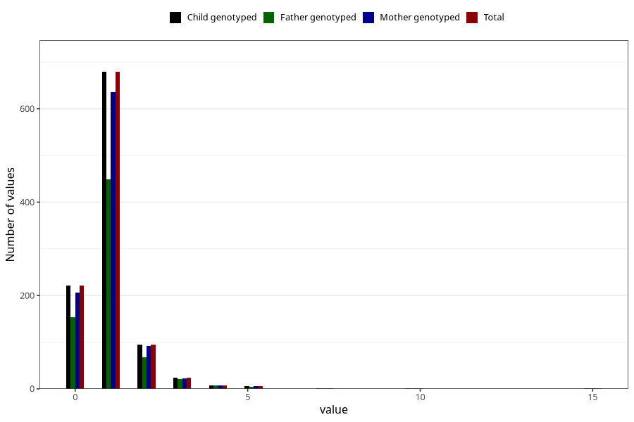

# urinary_tract_infection_number_12_18m
Variable mapping to `EE248` in `Skjema5_18mnd_v12`.
- Number of values:

| Value | Total | Child genotyped | Mother genotyped | Father genotyped |
| ----- | ----- | --------------- | ---------------- | ---------------- |
| Missing | 79986 | 79986 | 75257 | 52603 |
| Non-missing | 1037 | 1037 | 972 | 708 |
| 0 | 222 | 222 | 206 | 153 |
| 1 | 679 | 679 | 635 | 449 |
| 2 | 94 | 94 | 91 | 68 |
| 3 | 24 | 24 | 22 | 21 |
| 4 | 8 | 8 | 8 | 8 |
| 5 | 6 | 6 | 6 | 5 |
| 7 | 1 | 1 | 1 | 1 |
| 10 | 1 | 1 | 1 | 1 |
| 15 | 2 | 2 | 2 | 2 |

