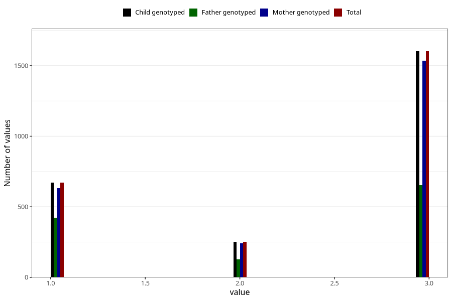

# vaccine_dt_freq_18m
Variable mapping to `EE154` in `Skjema5_18mnd_v12`.
- Number of values:

| Value | Total | Child genotyped | Mother genotyped | Father genotyped |
| ----- | ----- | --------------- | ---------------- | ---------------- |
| Missing | 78497 | 78497 | 73818 | 52104 |
| Non-missing | 2526 | 2526 | 2411 | 1207 |
| 1 | 671 | 671 | 633 | 424 |
| 2 | 253 | 253 | 243 | 128 |
| 3 | 1602 | 1602 | 1535 | 655 |

