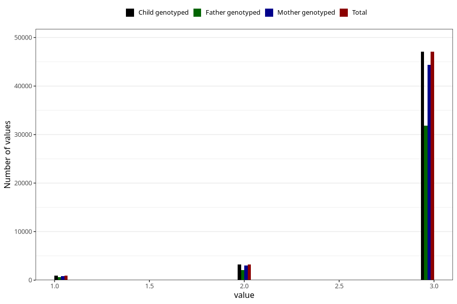

# vaccine_dtp_freq_18m
Variable mapping to `EE151` in `Skjema5_18mnd_v12`.
- Number of values:

| Value | Total | Child genotyped | Mother genotyped | Father genotyped |
| ----- | ----- | --------------- | ---------------- | ---------------- |
| Missing | 29819 | 29819 | 27989 | 18751 |
| Non-missing | 51204 | 51204 | 48240 | 34560 |
| 1 | 910 | 910 | 841 | 594 |
| 2 | 3229 | 3229 | 3039 | 2110 |
| 3 | 47065 | 47065 | 44360 | 31856 |

