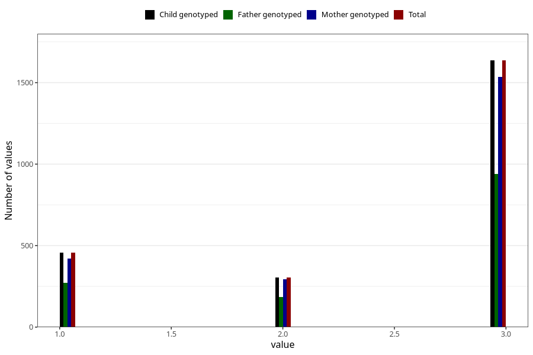

# vaccine_hepatitis_b_freq_18m
Variable mapping to `EE163` in `Skjema5_18mnd_v12`.
- Number of values:

| Value | Total | Child genotyped | Mother genotyped | Father genotyped |
| ----- | ----- | --------------- | ---------------- | ---------------- |
| Missing | 78626 | 78626 | 73979 | 51916 |
| Non-missing | 2397 | 2397 | 2250 | 1395 |
| 1 | 456 | 456 | 421 | 273 |
| 2 | 305 | 305 | 293 | 184 |
| 3 | 1636 | 1636 | 1536 | 938 |

