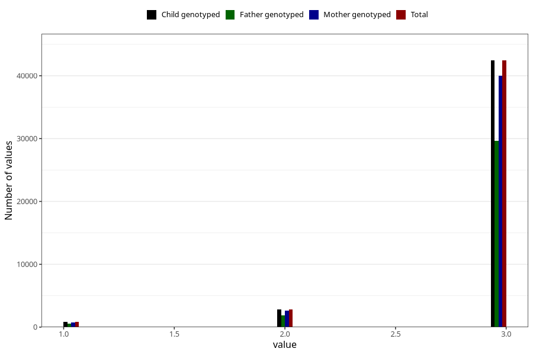

# vaccine_hib_freq_18m
Variable mapping to `EE784` in `Skjema5_18mnd_v12`.
- Number of values:

| Value | Total | Child genotyped | Mother genotyped | Father genotyped |
| ----- | ----- | --------------- | ---------------- | ---------------- |
| Missing | 34958 | 34958 | 32861 | 21236 |
| Non-missing | 46065 | 46065 | 43368 | 32075 |
| 1 | 832 | 832 | 775 | 561 |
| 2 | 2797 | 2797 | 2630 | 1885 |
| 3 | 42436 | 42436 | 39963 | 29629 |

