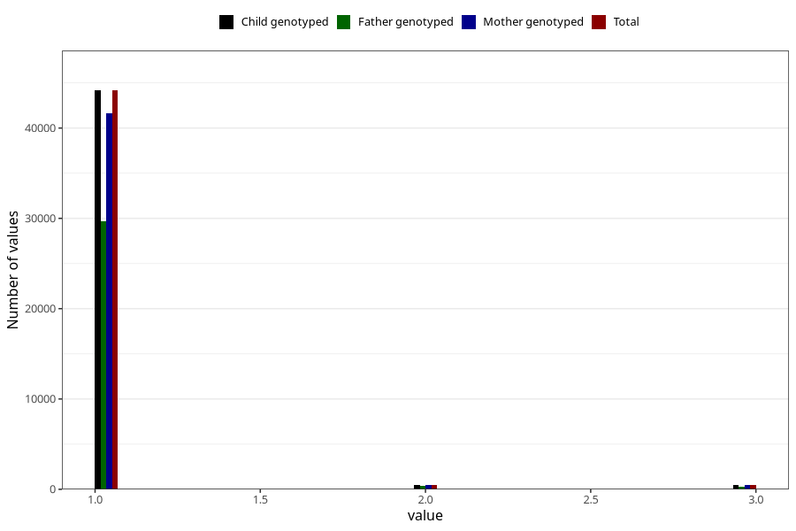

# vaccine_mmr_freq_18m
Variable mapping to `EE160` in `Skjema5_18mnd_v12`.
- Number of values:

| Value | Total | Child genotyped | Mother genotyped | Father genotyped |
| ----- | ----- | --------------- | ---------------- | ---------------- |
| Missing | 35820 | 35820 | 33636 | 23009 |
| Non-missing | 45203 | 45203 | 42593 | 30302 |
| 1 | 44163 | 44163 | 41623 | 29637 |
| 2 | 520 | 520 | 492 | 338 |
| 3 | 520 | 520 | 478 | 327 |

