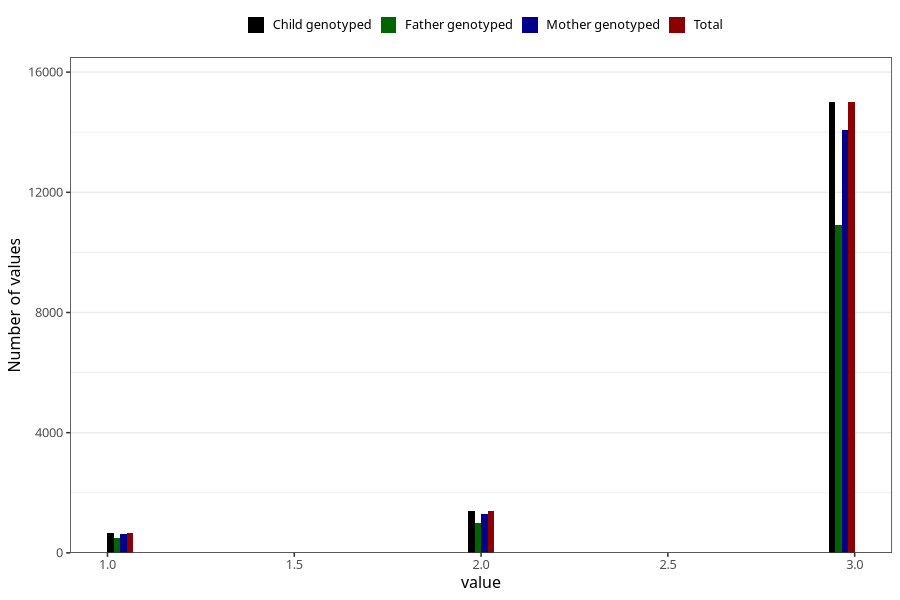

# vaccine_pneumococcus_freq_18m
Variable mapping to `EE1009` in `Skjema5_18mnd_v12`.
- Number of values:

| Value | Total | Child genotyped | Mother genotyped | Father genotyped |
| ----- | ----- | --------------- | ---------------- | ---------------- |
| Missing | 63964 | 63964 | 60245 | 40932 |
| Non-missing | 17059 | 17059 | 15984 | 12379 |
| 1 | 671 | 671 | 620 | 480 |
| 2 | 1389 | 1389 | 1307 | 997 |
| 3 | 14999 | 14999 | 14057 | 10902 |

