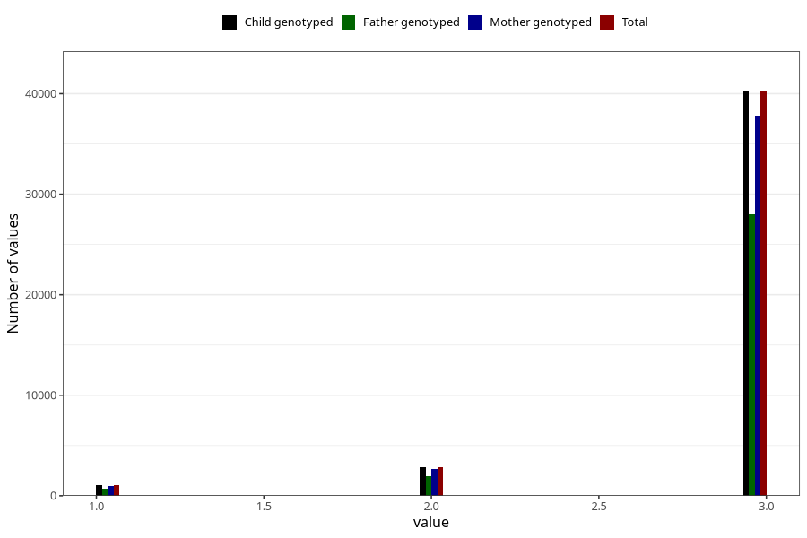

# vaccine_polio_freq_18m
Variable mapping to `EE956` in `Skjema5_18mnd_v12`.
- Number of values:

| Value | Total | Child genotyped | Mother genotyped | Father genotyped |
| ----- | ----- | --------------- | ---------------- | ---------------- |
| Missing | 36957 | 36957 | 34779 | 22749 |
| Non-missing | 44066 | 44066 | 41450 | 30562 |
| 1 | 1033 | 1033 | 954 | 686 |
| 2 | 2830 | 2830 | 2657 | 1913 |
| 3 | 40203 | 40203 | 37839 | 27963 |

