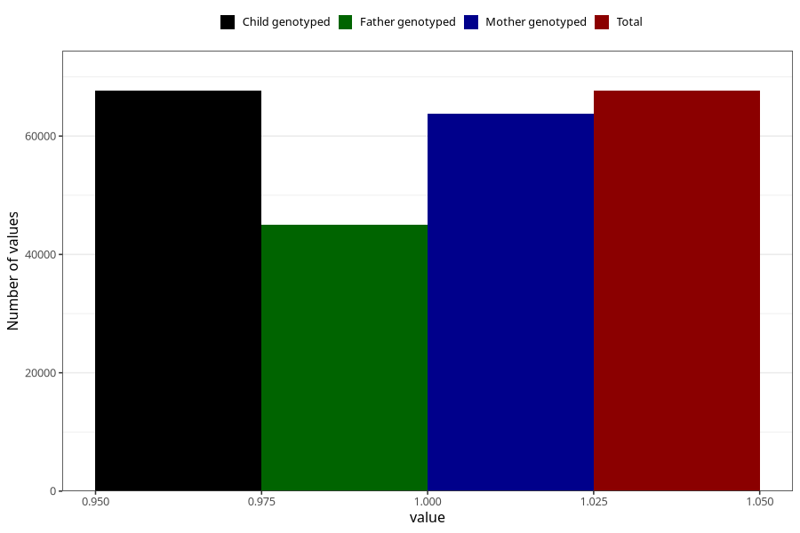

# breastmilk_0m
Variable mapping to `DD49` in `Skjema4_6mnd_v12`.
- Number of values:

| Value | Total | Child genotyped | Mother genotyped | Father genotyped |
| ----- | ----- | --------------- | ---------------- | ---------------- |
| Missing | 13373 | 13373 | 12476 | 8229 |
| Non-missing | 67650 | 67650 | 63753 | 45082 |
| 1 | 67650 | 67650 | 63753 | 45082 |

