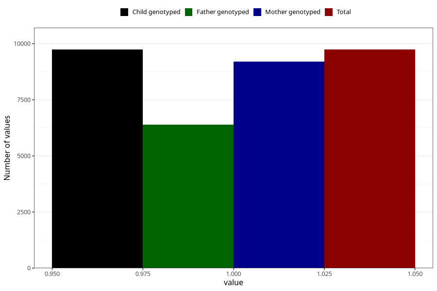

# breastmilk_15_18m
Variable mapping to `EE15` in `Skjema5_18mnd_v12`.
- Number of values:

| Value | Total | Child genotyped | Mother genotyped | Father genotyped |
| ----- | ----- | --------------- | ---------------- | ---------------- |
| Missing | 71285 | 71285 | 67037 | 46924 |
| Non-missing | 9738 | 9738 | 9192 | 6387 |
| 1 | 9738 | 9738 | 9192 | 6387 |

