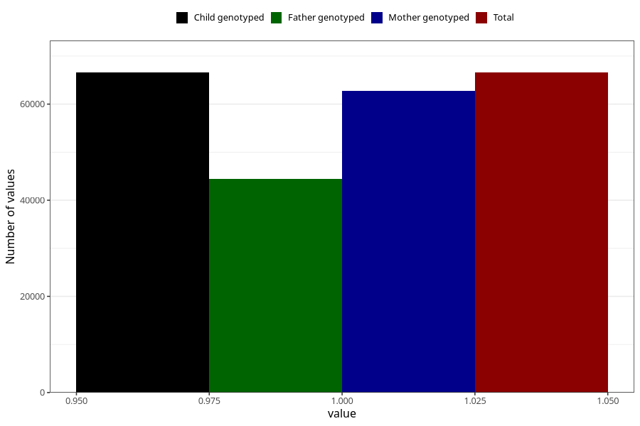

# breastmilk_1m
Variable mapping to `DD50` in `Skjema4_6mnd_v12`.
- Number of values:

| Value | Total | Child genotyped | Mother genotyped | Father genotyped |
| ----- | ----- | --------------- | ---------------- | ---------------- |
| Missing | 14462 | 14462 | 13494 | 8936 |
| Non-missing | 66561 | 66561 | 62735 | 44375 |
| 1 | 66561 | 66561 | 62735 | 44375 |

