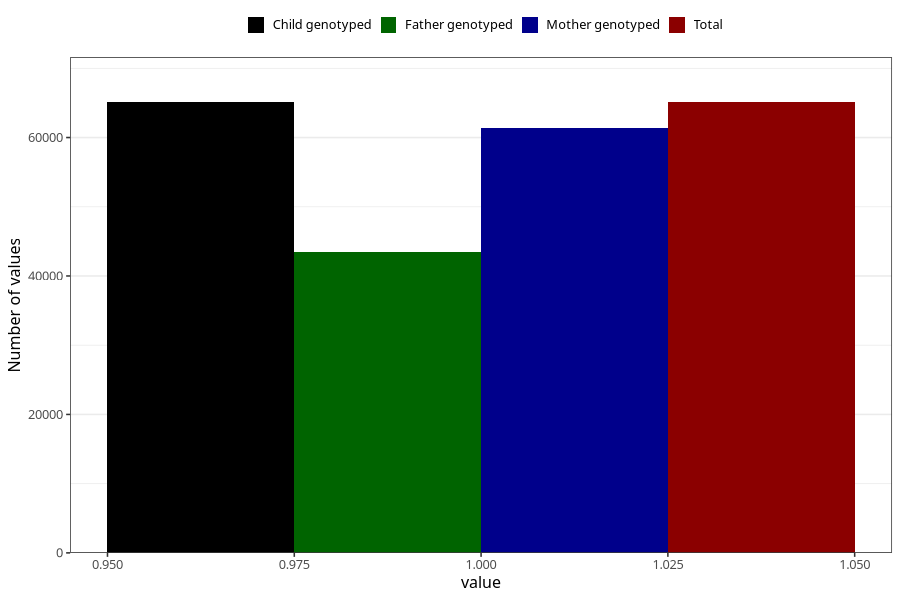

# breastmilk_2m
Variable mapping to `DD51` in `Skjema4_6mnd_v12`.
- Number of values:

| Value | Total | Child genotyped | Mother genotyped | Father genotyped |
| ----- | ----- | --------------- | ---------------- | ---------------- |
| Missing | 15917 | 15917 | 14862 | 9846 |
| Non-missing | 65106 | 65106 | 61367 | 43465 |
| 1 | 65106 | 65106 | 61367 | 43465 |

