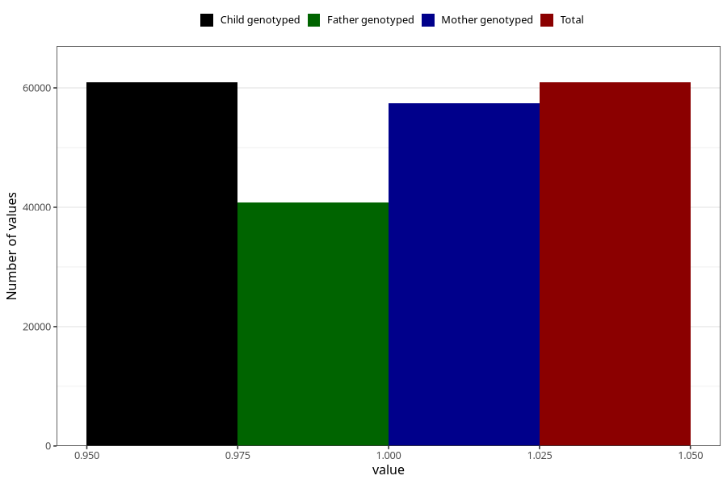

# breastmilk_4m
Variable mapping to `DD53` in `Skjema4_6mnd_v12`.
- Number of values:

| Value | Total | Child genotyped | Mother genotyped | Father genotyped |
| ----- | ----- | --------------- | ---------------- | ---------------- |
| Missing | 20106 | 20106 | 18770 | 12512 |
| Non-missing | 60917 | 60917 | 57459 | 40799 |
| 1 | 60917 | 60917 | 57459 | 40799 |

