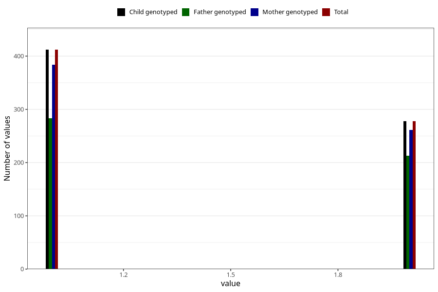

# fish_oil_capsules_amount_per_time_7y
Variable mapping to `JJ536` in `Skjema7aar_v12`.
Variable mapping to `JJ536` in `Skjema7aar_v12`.
- Number of values:

| Value | Total | Child genotyped | Mother genotyped | Father genotyped |
| ----- | ----- | --------------- | ---------------- | ---------------- |
| Missing | 80324 | 80324 | 75576 | 52809 |
| Non-missing | 699 | 699 | 653 | 502 |
| 3+ at a time | 9 | 9 | 8 |6 |
| 1 | 412 | 412 | 384 | 283 |
| 2 | 278 | 278 | 261 | 213 |

