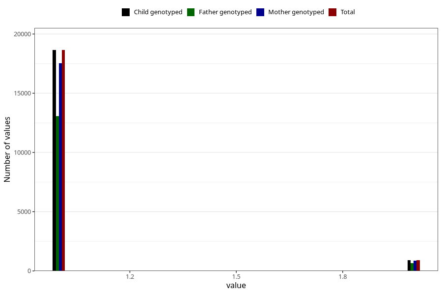

# fluoride_capsules_amount_per_time_7y
Variable mapping to `JJ540` in `Skjema7aar_v12`.
Variable mapping to `JJ540` in `Skjema7aar_v12`.
- Number of values:

| Value | Total | Child genotyped | Mother genotyped | Father genotyped |
| ----- | ----- | --------------- | ---------------- | ---------------- |
| Missing | 61444 | 61444 | 57803 | 39597 |
| Non-missing | 19579 | 19579 | 18426 | 13714 |
| 3+ at a time | 21 | 21 | 17 |16 |
| More than 1 check box filled in | 5 | 5 | 4 |4 |
| 1 | 18644 | 18644 | 17555 | 13054 |
| 2 | 909 | 909 | 850 | 640 |

