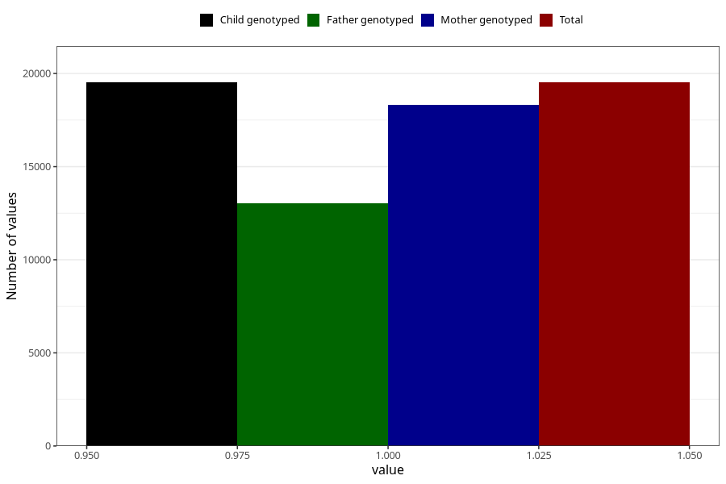

# formula_6_8m
Variable mapping to `EE16` in `Skjema5_18mnd_v12`.
- Number of values:

| Value | Total | Child genotyped | Mother genotyped | Father genotyped |
| ----- | ----- | --------------- | ---------------- | ---------------- |
| Missing | 61503 | 61503 | 57922 | 40294 |
| Non-missing | 19520 | 19520 | 18307 | 13017 |
| 1 | 19520 | 19520 | 18307 | 13017 |

